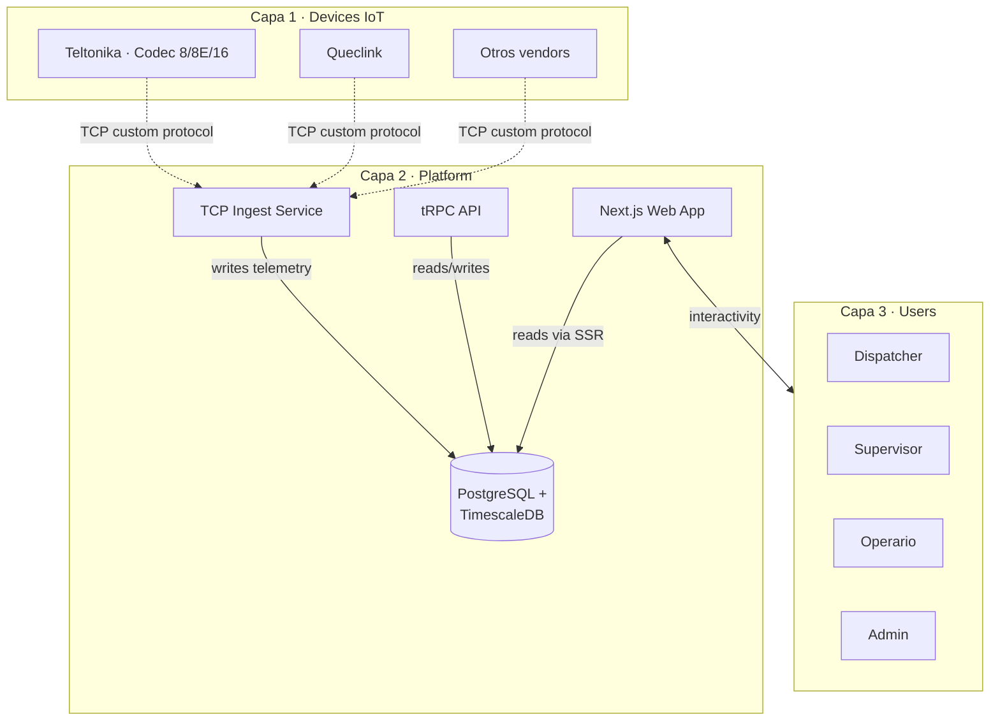
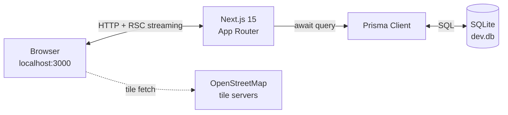
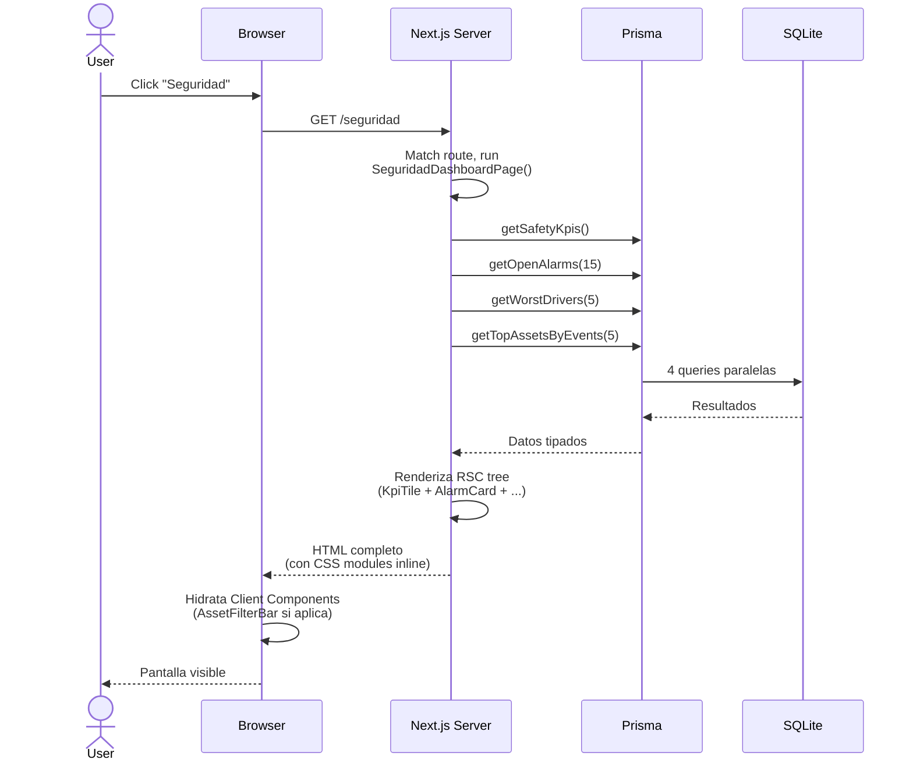
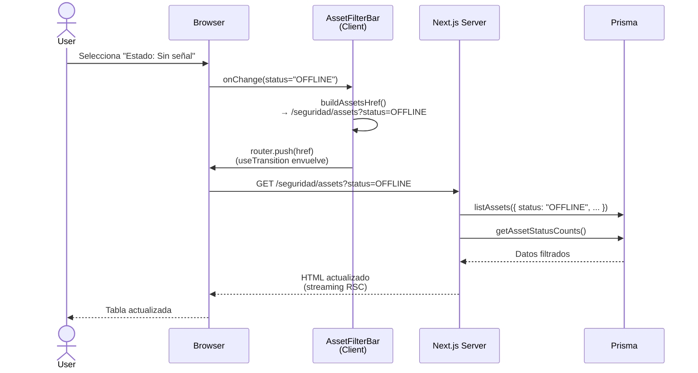
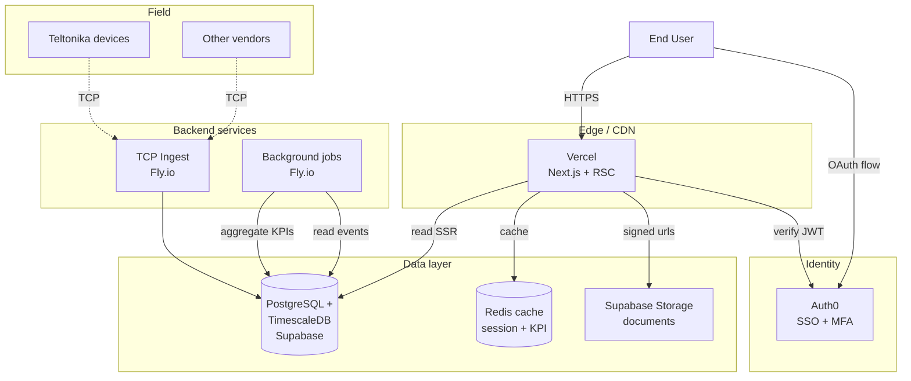
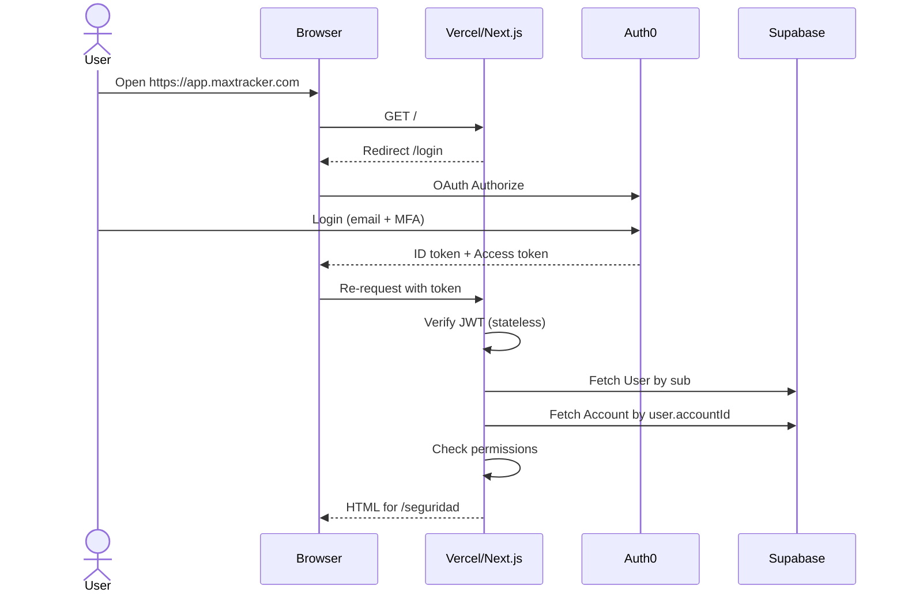

# Architecture

> **Maxtracker · Telemática IoT enterprise**
> Documento de arquitectura del sistema.
> Cubre estado actual (demo funcional · Lote 1 + 2) y target de producción.

---

## Tabla de contenidos

1. [Vista general del sistema](#1--vista-general-del-sistema)
2. [Arquitectura del demo (estado actual)](#2--arquitectura-del-demo-estado-actual)
3. [Request lifecycle](#3--request-lifecycle)
4. [Data flow por patrón de página](#4--data-flow-por-patrón-de-página)
5. [Production target](#5--production-target)
6. [Security model (preview)](#6--security-model-preview)
7. [Performance & escalabilidad](#7--performance--escalabilidad)
8. [Decisiones diferidas](#8--decisiones-diferidas)

---

## 1 · Vista general del sistema

Maxtracker es un sistema de **3 capas conceptuales**:



**Tres flujos principales:**

1. **Ingesta** · devices IoT → TCP service → DB (write-heavy, append-only)
2. **Operación** · users ↔ web app ↔ DB (read-heavy con escrituras puntuales)
3. **Reporting / Boletines** · DB → agregaciones programadas → KpiDailySnapshot

En el **demo actual (Lote 1+2)** solo está implementada la capa de
**operación** (web app + DB). La ingesta se simula con un seed
determinístico.

---

## 2 · Arquitectura del demo (estado actual)



### Componentes

| Componente | Tecnología | Responsabilidad |
|---|---|---|
| Browser | Cualquier moderno | Renderiza HTML server-side, hidrata Client Components |
| Next.js Server | Node 20+ | Routing, RSC rendering, queries Prisma |
| Prisma Client | TypeScript | ORM type-safe, query builder |
| SQLite | Embebida en proceso | Storage de demo, single file `prisma/dev.db` |
| Leaflet | Cliente browser | Renderiza tiles OSM en mini-mapas |

### Decisiones arquitectónicas en juego

| Decisión | ADR |
|---|---|
| Server Components first (RSC default) | ADR-005 |
| CSS Modules + tokens, no Tailwind | ADR-006 |
| URL como source of truth | ADR-003 |
| Component layering en 5 capas | ADR-004 |
| Dynamic import para libs SSR-incompatibles | ADR-007 |
| Seed determinístico (faker.seed(42)) | ADR-008 |

---

## 3 · Request lifecycle

Cómo viaja una request desde que el usuario abre la URL hasta que ve
contenido.

### Caso típico · Dashboard D (`/seguridad`)



**Tiempos típicos en local:**
- Server-side render: ~30-80ms
- Browser receive + paint: ~20-40ms
- **Total perceived:** ~100ms

### Caso con interactividad · cambiar filtro en Lista A



**Punto clave:** la URL es la única fuente de verdad. Refrescar la
página o compartir el link reproduce exactamente el mismo estado
(ADR-003).

---

## 4 · Data flow por patrón de página

Maxtracker tiene 4 patrones canónicos de página. Lote 1 implementó 3.

### Patrón D · Dashboard (`/seguridad`)

```
┌─────────────────────────────────────────┐
│ KPI Strip (4 métricas top-line)         │
├──────────────────────┬──────────────────┤
│ Open Alarms list     │ Top Drivers      │
│ (col 2fr)            ├──────────────────┤
│                      │ Top Assets       │
└──────────────────────┴──────────────────┘
```

**Queries:** 4 paralelas (KPIs, alarmas, drivers, assets).
**Refresh:** dinámico (`force-dynamic`) en demo, en prod será cache
con TTL + revalidación on-write.

### Patrón A · Lista de Assets (`/seguridad/assets`)

```
┌─────────────────────────────────────────┐
│ KPI Strip (5 status counts)             │
├─────────────────────────────────────────┤
│ Filter Bar (search + 4 dropdowns)       │
├─────────────────────────────────────────┤
│ Table (sortable, clickeable rows)       │
├─────────────────────────────────────────┤
│ Pagination footer                       │
└─────────────────────────────────────────┘
```

**Queries:** 4 paralelas (lista, counts, accounts dropdown, groups
dropdown).
**State:** todo en URL (search, filters, sort, page).
**Interactividad:** `AssetFilterBar` es Client; el resto Server.

### Patrón B · Libro del Asset (`/seguridad/assets/[id]`)

```
┌─────────────────────────────────────────┐
│ AssetHeader (name + status + meta)      │
├─────────────────────────────────────────┤
│ KPI Strip (4 contextual)                │
├─────────────────────────────────────────┤
│ Tabs (Overview · Alarmas · ...)         │
├──────────────────────┬──────────────────┤
│ Tab content          │ Side content     │
│ (Overview: map +     │ (events +        │
│  position metadata)  │  open alarms)    │
└──────────────────────┴──────────────────┘
```

**Queries:** depende del tab activo. Overview = 3 queries (asset,
events, open alarms). Alarmas = 1 query (todas las alarmas del asset).
**Tab state:** en URL (`?tab=alarmas`).

### Patrón C · Boletín (no implementado)

Reservado para Lote 3. Reportes de período cerrado (semanal, mensual)
con secciones tipo Bloques A-J. Diferencia clave: **no se calcula en
tiempo real** — se pre-genera al cierre del período (KpiDailySnapshot
agregado).

---

## 5 · Production target

Esto **no está implementado todavía**. Documenta a qué arquitectura se
migra cuando llegue Lote 4-5.



### Componentes de producción

| Componente | Tecnología | Lote estimado |
|---|---|---|
| Frontend | Next.js + Vercel Edge | Lote 4 |
| Database | Supabase (Postgres) + TimescaleDB extension | Lote 3 o 4 |
| Cache | Redis (Upstash o Vercel KV) | Lote 4 |
| File storage | Supabase Storage | Lote 4 |
| Auth | Auth0 (16 roles RBAC) | Lote 4 |
| TCP ingest | Custom Node service en Fly.io | Lote 5 |
| Background jobs | Trigger.dev o Fly.io workers | Lote 5 |
| Observability | Sentry + Vercel Analytics + custom | Lote 5 |

### Por qué este stack

**Vendor-agnosticism por diseño:**

- Next.js puede correr en Vercel, AWS, propio. La elección concreta es
  la de Vercel por DX y edge runtime, pero portar a otro provider es
  mecánico.
- Postgres es estándar de la industria. TimescaleDB es una extensión
  open-source instalable en cualquier Postgres.
- Auth0 puede reemplazarse por Clerk, Supabase Auth, o custom + JWT
  sin cambios de modelo de datos.
- Fly.io, Supabase, Upstash son intercambiables entre sí.

**Cost-aware:**

- Free tiers cubren el demo y pruebas hasta ~10k assets reales
- Costos lineales con uso (no contratos enterprise mínimos)
- Supabase + Fly.io + Vercel + Auth0 = ~USD 100-300/mes para arrancar

**Kubernetes explícitamente evitado:**

- Sobre-engineering para el escalado actual
- Cost overhead vs PaaS managed
- Reconsideración cuando lleguemos a 100k+ assets en producción

---

## 6 · Security model (preview)

**No implementado en demo. Sketch para Lote 4.**

### Auth flow



### Row-Level Security (RLS)

Todas las queries deben tener implícito un filtro `accountId` derivado
del User logueado. Postgres RLS hace esto a nivel DB con policies, lo
que **previene leaks** incluso si la app tiene un bug:

```sql
ALTER TABLE Asset ENABLE ROW LEVEL SECURITY;

CREATE POLICY asset_account_isolation ON Asset
  USING (accountId = current_setting('app.account_id'));
```

Cada request setea `app.account_id` desde el JWT verificado. Una query
que olvida filtrar por accountId se queda sin resultados (no leak).

### RBAC (16 roles)

Memoria del proyecto: el sistema soporta hasta 16 roles. Sketch:

```
Owner          → todo
Admin          → todo dentro del account
Dispatcher     → operación + read-only de config
Supervisor     → reportes + alarmas, no edita config
Operator       → trabajo de Patrón D, no entra a settings
Driver         → ve solo sus propios assets/eventos
Read-only      → ningún write
... (10 roles más con scopes específicos)
```

ADR-XXX formal cuando se implemente en Lote 4.

---

## 7 · Performance & escalabilidad

### Estado actual (demo)

| Métrica | Valor |
|---|---|
| Assets | 80 |
| Posiciones | ~16.000 |
| Eventos | ~350 |
| Alarmas | ~60 |
| Tiempo de seed | 15-30s |
| Tiempo de page load | ~100ms |
| Bundle JS | ~180KB (gzip) |

A esta escala, no hay problemas de performance. Todo se resuelve con
queries SQL razonables y el tiempo dominante es la red.

### Punto de quiebre estimado de SQLite

| Carga | SQLite alcanza? | Por qué |
|---|---|---|
| 10k assets · 100k posiciones | ✅ | Single-writer pero queries < 50ms |
| 100k assets · 1M posiciones | ⚠️ marginal | Inserts comienzan a competir |
| 1M assets · 16M posiciones | ❌ no | Queries time out, write contention |

### Estrategias de scaling (production target)

1. **TimescaleDB hypertables** para Position y Event
   → particionamiento automático por tiempo
   → queries de "última semana" escanean solo los chunks relevantes
2. **Compresión de chunks viejos** (5x-10x reducción)
3. **Continuous aggregates** para KpiDailySnapshot pre-calculado
4. **Read replicas** cuando el dashboard se vuelva read-heavy
5. **Caching agresivo** de KPIs en Redis (TTL 60s)
6. **Edge rendering** para páginas frecuentes via Vercel Edge

### Throughput de ingesta target

```
Capacidad target:    11.500 events/segundo
Eso requiere:        ~1B events/día
Eso requiere:        TimescaleDB con compresión
                  +  partitioning por accountId (hash)
                  +  TCP ingest distribuido
                  +  back-pressure handling
```

ADR específico de ingestion architecture llega en Lote 5.

---

## 8 · Decisiones diferidas

Decisiones arquitectónicas conscientemente postergadas para después:

| Decisión | Cuándo | Por qué se difiere |
|---|---|---|
| Migración a Postgres | Lote 3 o 4 | SQLite alcanza para iteración UX |
| Auth0 integration | Lote 4 | Multi-tenancy implícita en URL state hasta entonces |
| TCP ingest service | Lote 5 | Demo no necesita ingesta real |
| Background jobs | Lote 5 | Sin agregaciones cron-based hasta tener KpiDailySnapshot |
| Caching layer | Lote 4 | Sin cache hasta tener > 100 req/s |
| Sentry + observability | Lote 4 | Local console.log alcanza en dev |
| Multi-region deployment | Lote 6+ | Lat-AM cliente es Lat-AM servidor |
| White-label / reseller | Lote 6+ | Multi-account dentro de Account es suficiente al inicio |

Cada una se promueve a "decidida" con su ADR correspondiente cuando
llegue su momento.

---

## Glosario

- **RSC** · React Server Components
- **TTFB** · Time To First Byte
- **RBAC** · Role-Based Access Control
- **RLS** · Row-Level Security (Postgres)
- **MFA** · Multi-Factor Authentication
- **PaaS** · Platform-as-a-Service
- **ETL** · Extract, Transform, Load
- **TTL** · Time To Live (cache expiration)
- **JWT** · JSON Web Token

---

## Versioning

| Versión | Fecha | Cambios |
|---|---|---|
| 1.0 | 2026-04-25 | Documento inicial · Sub-lote 2.4 |
